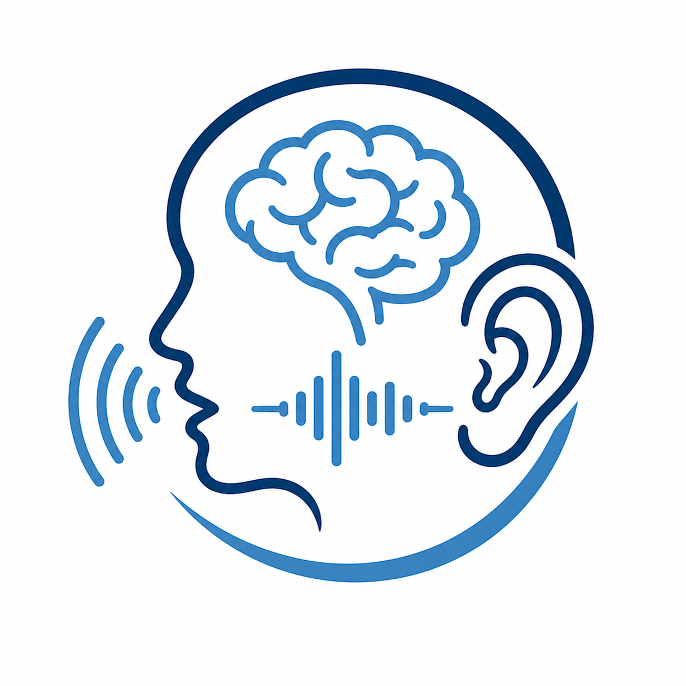

  
  <h1>TELE-SPEAK Nepal</h1>
  <h3>Speech • Language • Hearing • Communication • Cognition</h3>
  
Accessible communication support for children and adults in Nepal and across the globe

<!-- # TELE-SPEAK Nepal 

### Speech • Language • Hearing • Communication • Cognition

Accessible communication support for children and adults across globes. -->

  <h2> Tele-therapy for underserved communities in Nepal and the multilingual Nepali diaspora around the world </h2>

---

  <a class="button" href="appointment.html">Book Your Appointment</a>

---

## OUR MISSION

TELE-SPEAK Nepal is a virtual platform to help individuals with communication disorders access the service at their door step. Our mission is to improve access to speech, language, hearing, and communication services in Nepal through accessible, affordable, and culturally responsive services remotely.

---

## WHO CAN BENEFIT?
 

### Children

- Speech or language delay
  - e.g., children with autism spectrum disorder, Down syndrome, cerebral palsy
- Speech sound disorders
  - e.g., misarticulation

### Adults

- Speech disorders
  - e.g., voice disorders, fluency disorders
- Neurological communication disorders
  - e.g., post-stroke aphasia, dysarthria
- Swallowing difficulties (dysphagia)

### Both children and adults

- Individuals with hearing and listening concerns
  - e.g., hearing loss, auditory processing disorder (APD)
- Cochlear implantees
- Hearing aid users
- Individuals experiencing ringing in the ear and sound sensitivity disorders 
  - e.g., tinnitus, misophonia, hyperacusis

### Other stakeholders

- Individuals living in areas with limited access to specialists  
- Schools in remote and suburban Nepal that need help understanding special communication needs of their students
- Local governments seeking expertis to train their staff and health-workers
- Corporate and non-government organisations seeking awareness on disability and communication difficulties
- Teachers seeking awareness on voice hygiene
  
<!-- - Children with speech or language delay (e.g., children with Austism Spectrum Disorder, Down syndrome) 
- Children with speech sound disorders
- Adults with speech disorders (e.g., voice disorders, fluency disorders)
- Adults with neurological communication disorders (e.g., post-stroke aphasia, dysarthria)
- Individuals with hearing and listening concerns (e.g., hearing loss, auditory processing disorder)
- Individuals experiencing tinnitus and sound sensitivity disorders  
- Caregivers seeking training on speech and language intervention
- Individuals living in areas with limited access to specialists  
- Schools that help children with special communication needs-->

---

TELE-SPEAK Nepal provides telepractice-based support for both assessment and management of communication disorders. In-person evaluation or medical/audiological care may be recommended whenever necessary.

